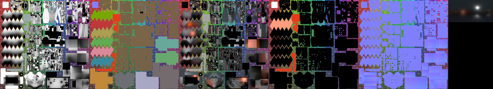

## Example - my static baked scene

### Description

This scene is made of several objects with number of texture types assinged.
There is one common vertex and fragment shader and one common set of textures, which define object's look.
Object's UV coordinates assign part of texture to given object.
So far there are:

* color map,
* diffuse direct + indirect map,
* AO map,
* emit map,
* normal map,
* reflection (cylindrical) environment maps generated from various places.

Missing ones:

* metalness map,
* roughness map,
* specular intensity map,
* emission intensity map,
* bump map,
* transparency map,
* index of refraction map.

Texture maps were baked in Blender + Cycles (low quality so far), most models were also created in Blender.

The plan is to move from static diffuse direct + indirect map into diffuse direct env. map.
Reflections should be parallax corrected (maybe also reflection depth map to achieve this?).
Env. maps should also be of high dynamic range, now there is gradient visible and reflected lights are not as convincing as they should be.

### Links

* [video from 2017-09-08](https://www.youtube.com/watch?v=zRUCXRtDeTg)

### Attributions

* The battle droid model was done by Kinga Kępińska.
